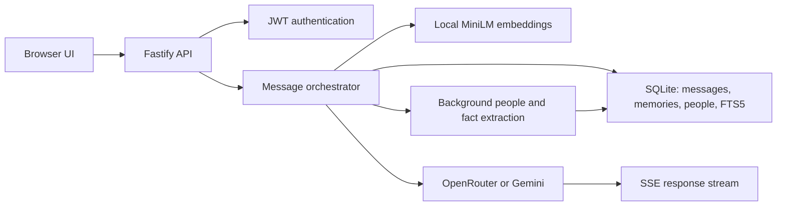

# AGI-v1

[](https://github.com/aryamthecodebreaker/AGI-v1/actions/workflows/ci.yml)

AGI-v1 is an experimental multi-user chatbot with searchable, cross-conversation memory. It stores conversation turns in SQLite, retrieves relevant history with full-text and vector search, and streams responses from a configurable LLM backend.

- Live deployment: [agi-v1-five.vercel.app](https://agi-v1-five.vercel.app)
- Source: [github.com/aryamthecodebreaker/AGI-v1](https://github.com/aryamthecodebreaker/AGI-v1)

> [!WARNING]
> The Vercel deployment is a demo, not durable production hosting. It stores SQLite data under `/tmp/agi-data`, which is ephemeral and is not shared between serverless instances. Accounts, conversations, and memories can disappear or become unavailable between requests. Run locally for persistent single-machine storage, or replace SQLite with a shared database before relying on the hosted version.

## What currently works

- Username/password registration and login with bcrypt password hashes and JWT cookies.
- Per-user conversations, messages, memories, and tracked people.
- Server-Sent Events (SSE) for streamed chat responses.
- Raw-turn memory for user and assistant messages.
- Background extraction of people and durable facts in one LLM call.
- Grounding checks that reject extracted names and distinctive fact tokens that are absent from the user's message.
- Hybrid retrieval using SQLite FTS5 ranking and embedding cosine similarity, combined with Reciprocal Rank Fusion (RRF).
- FTS-only fallback when the local embedding model is unavailable.
- Per-route rate limits for registration, login, and chat.
- A vanilla HTML, CSS, and JavaScript interface for chat, conversations, people, and memories.
- A Vercel serverless entry point and a Docker image intended for local or Hugging Face-style container hosting.

This is a retrieval-and-memory chatbot, not artificial general intelligence. Memory quality depends on retrieval, extraction, model output, and the persistence of the selected deployment environment; recall is not guaranteed.

## LLM backend status

| Backend | Configuration | Current status |
|---|---|---|
| OpenRouter | `LLM_BACKEND=openrouter` and `OPENROUTER_API_KEY` | Implemented. The Vercel deployment selects `openrouter/free`. Model availability and routing are controlled by OpenRouter. |
| Google Gemini | `LLM_BACKEND=gemini` and `GEMINI_API_KEY` | Implemented and still the default in `.env.example`. It is not the current Vercel production backend. |
| Local Transformers.js | `LLM_BACKEND=transformers` | Backend code exists, but selection currently fails in the ESM build with `require is not defined`. Do not treat offline inference as working yet. |
| Scratch model | `LLM_BACKEND=scratch` | Placeholder only. `src/llm/scratchBackend.ts` and the referenced training scripts do not exist. |

When a hosted backend is selected, the prompt, recent turns, and retrieved memory context are sent to that provider. The application is therefore not fully local in those modes.

## Architecture



For each accepted chat message, the orchestrator:

1. Verifies that the conversation belongs to the authenticated user.
2. Stores the user message.
3. Embeds and stores it as a `raw_turn` memory, falling back to a non-vector memory if embedding fails.
4. Loads recent turns, relevant memories, and recently mentioned people.
5. Builds an LLM prompt and streams response tokens over SSE.
6. Stores the assistant response and its raw-turn memory.
7. Starts a background LLM call to extract grounded people and facts.

The retrieval layer searches only the authenticated user's memory rows. Vector search currently scans at most 5,000 recent memories before ranking the best matches.

## Storage behavior

| Environment | Default data location | Persistence |
|---|---|---|
| Local development | `./data/agi.db` after copying `.env.example` | Persists on that machine until the file is removed. |
| Docker | `/home/node/app/data/agi.db` | Persists only when the container has a persistent volume or disk. |
| Vercel | `/tmp/agi-data/agi.db` | Temporary and instance-local; not suitable for durable accounts or memory. |

Embeddings are stored as `Float32Array` blobs in SQLite. The configured MiniLM model is downloaded locally on first use and cached under the selected data directory.

## Run locally

Requirements:

- Node.js 20 or newer.
- An API key for either Gemini or OpenRouter.

```bash
git clone https://github.com/aryamthecodebreaker/AGI-v1.git
cd AGI-v1
npm ci
cp .env.example .env
```

On PowerShell, copy the environment file with:

```powershell
Copy-Item .env.example .env
```

Choose one hosted backend in `.env`.

Gemini:

```dotenv
LLM_BACKEND=gemini
LLM_MODEL_ID=gemini-2.5-flash
GEMINI_API_KEY=your_key_here
```

OpenRouter:

```dotenv
LLM_BACKEND=openrouter
LLM_MODEL_ID=openrouter/free
OPENROUTER_API_KEY=your_key_here
```

For stable sessions, set `JWT_SECRET` to a random value of at least 32 characters. In local development, the app generates and writes one to `.env` when it is missing.

Start the development server:

```bash
npm run dev
```

Open [http://localhost:3000](http://localhost:3000). New passwords must contain at least 10 characters, including an uppercase letter, lowercase letter, number, and symbol.

## Tests and build

```bash
npm test
npm run build
```

The current suite contains 22 tests covering auth utilities, storage repositories, the orchestrator, and HTTP error conversion. GitHub Actions runs `npm ci`, `npm test`, and `npm run build` for pull requests and pushes to `main`.

The build currently emits the server entry point as `dist/src/index.js`. The package's `npm start` command still points to `dist/index.js`, so use `npm run dev` or the following command after building:

```bash
node dist/src/index.js
```

## Vercel deployment

`vercel.json` configures:

- `api/index.ts` as the Fastify serverless entry point.
- `LLM_BACKEND=openrouter`.
- `LLM_MODEL_ID=openrouter/free`.
- `DATA_DIR=/tmp/agi-data`.
- A 300-second function duration and bundled migration, public, and ONNX runtime files.

The Vercel project also requires these environment variables:

- `OPENROUTER_API_KEY`
- `JWT_SECRET` (at least 32 characters)
- `VERCEL_SUPPORT_LARGE_FUNCTIONS=1`

Large-function support is required because the bundled function exceeds Vercel's standard uncompressed function limit. Preview deployments need the same setting.

## Known limitations

- Vercel storage is temporary and not shared between function instances.
- The local Transformers.js backend is not runnable through the current ESM registry implementation.
- The scratch backend is not implemented.
- `npm start` points to the wrong compiled entry path.
- The `seed`, `verify`, and `train:scratch` package scripts point to files that are not present.
- Vector search is an in-process scan of up to 5,000 stored memories, not a dedicated vector index.
- Background extraction is best-effort; failures leave the raw turns intact but may omit structured people or facts.
- There is no account recovery, email verification, password reset, or administrative interface.

## Roadmap

- Add a shared, durable database for hosted accounts, conversations, and memories.
- Repair and test the local Transformers.js backend under ESM.
- Fix the production start script and remove or implement missing helper scripts.
- Implement the scratch backend only after its scope and training data policy are defined.
- Add end-to-end browser tests for registration, login, cross-conversation recall, and rate-limit errors.

## License

MIT. See [LICENSE](./LICENSE).
