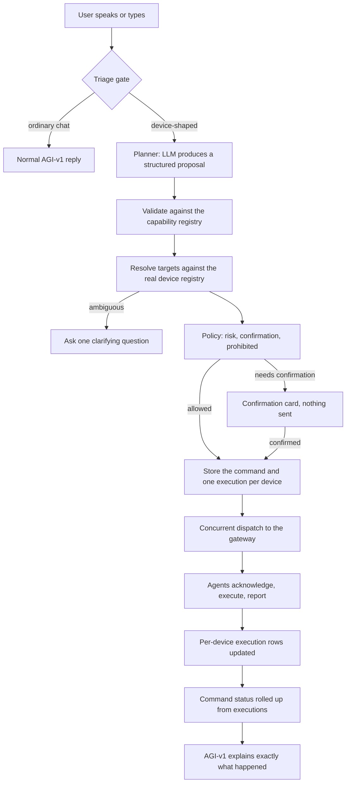
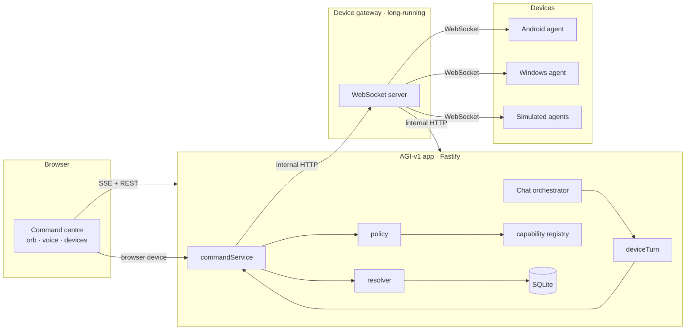

# AGI Command — architecture

AGI Command turns AGI-v1 into a voice-first assistant that can act on your
devices. AGI-v1 understands the request, remembers context, decides what should
happen, and coordinates. Small trusted agents installed on your devices perform
the actual work and report back.

The single rule everything else follows from:

> **AGI-v1 never claims a device action succeeded without a real result from that
> device.**

---

## The split of responsibilities

The LLM interprets language. The application is authoritative about everything
else.

| The model decides | The application decides |
|---|---|
| What the user probably meant | Which devices exist |
| How to phrase the target ("the phones") | Which devices belong to this user |
| Which action name fits | Which devices are online |
| | Which capabilities each device supports |
| | Whether confirmation is required |
| | Whether a command was sent |
| | Whether it succeeded, failed or timed out |
| | Whether it already ran |

A malformed or invented plan is discarded, never executed. See
[`src/devices/planner.ts`](../src/devices/planner.ts).

---

## Flow



---

## Components



### Why the gateway is a separate service

Persistent connections need a process that stays alive. A serverless request
handler does not. Rather than pretend otherwise, sockets live in a small
long-running gateway, and the app talks to it over an authenticated internal
HTTP API.

The gateway is deliberately ignorant. It does not know what a user is, what a
policy is, or whether a command should run. It authenticates a device by asking
the app, relays validated frames, and reports what it saw. All state lives in the
app's database.

If the gateway is down, ordinary AGI-v1 chat is unaffected and the interface says
device control is temporarily unavailable.

---

## Source map

| Path | Responsibility |
|---|---|
| [`src/devices/capabilities.ts`](../src/devices/capabilities.ts) | The closed set of allowed actions, with schemas, risk and timeouts |
| [`src/devices/policy.ts`](../src/devices/policy.ts) | One decision point for risk, confirmation and refusal |
| [`src/devices/protocol.ts`](../src/devices/protocol.ts) | Versioned wire format, validated in both directions |
| [`src/devices/credentials.ts`](../src/devices/credentials.ts) | Pairing codes and device credentials |
| [`src/devices/deviceService.ts`](../src/devices/deviceService.ts) | Pairing, registration, authentication, revocation |
| [`src/devices/resolver.ts`](../src/devices/resolver.ts) | Deterministic target resolution |
| [`src/devices/planner.ts`](../src/devices/planner.ts) | Triage gate and LLM planning |
| [`src/devices/commandService.ts`](../src/devices/commandService.ts) | Command lifecycle, dispatch, results, retry, cancel |
| [`src/devices/workflowService.ts`](../src/devices/workflowService.ts) | Reusable multi-device routines |
| [`src/devices/status.ts`](../src/devices/status.ts) | Rollup from executions to a command status |
| [`src/devices/narrate.ts`](../src/devices/narrate.ts) | Honest sentences built from stored state |
| [`src/gateway/`](../src/gateway) | The standalone WebSocket gateway |
| [`src/brain/deviceTurn.ts`](../src/brain/deviceTurn.ts) | Bridge into the existing chat loop |
| [`agents/`](../agents) | Android, Windows and simulated device agents |

---

## Command lifecycle

A command is stored **before** anything is dispatched, so a crash mid-flight
leaves a record of what was attempted.

Per-device execution states:

```
pending · waiting_for_confirmation · queued · dispatching · dispatched
acknowledged · running · succeeded · failed · timed_out · cancelled
unsupported · rejected · device_offline · expired
```

The command's overall status is always **derived** from its executions, never set
independently:

| Executions | Command |
|---|---|
| any still open | `in_progress` (or `queued` / `awaiting_confirmation`) |
| all succeeded | `succeeded` |
| some succeeded, some not | `partially_succeeded` |
| none succeeded | `failed` |
| all cancelled | `cancelled` |

A command over five devices with three successes, one failure and one offline
device reports `partially_succeeded` and names all five. See
[`rollupCommandStatus`](../src/devices/status.ts).

---

## Concurrency

Every online target is contacted without waiting for the previous one
(`Promise.allSettled` over the pending executions), and each is tracked
separately. "Simultaneous" means concurrent dispatch — it does not claim that
two different operating systems visibly complete in the same millisecond.

---

## Offline devices

By default, online devices receive the action and offline devices are reported
immediately. The command does not sit pending forever.

Explicit delayed execution is available for safe capabilities
(`queueable: true`): the execution is `queued`, and flushed when the device
reconnects. Queued work carries an expiry, runs at most once, and is dropped if
the command was cancelled or expired while the device was away. Because a queued
action is a side effect the user will not be watching for, queueing is treated as
moderate risk and asks first.

---

## What this deliberately does not do

- No unrestricted shell or script execution, on any platform.
- No unlocking a device, or bypassing a PIN, password or biometric.
- No hidden recording of microphone, camera or screen.
- No credential extraction, privilege escalation, or disabling security tools.
- No access to another user's devices.
- No execution of downloaded or model-generated programs.

These are enforced by a hard denylist in the capability registry plus a refusal
path in [`policy.ts`](../src/devices/policy.ts), and are not configurable.

---

## Related documents

- [Device protocol](./device-protocol.md)
- [Pairing](./device-pairing.md)
- [Security and threat model](./security-threat-model.md)
- [Gateway deployment](./gateway-deployment.md)
- [Voice architecture](./voice-architecture.md)
- [Workflows](./workflows.md)
- [Android agent](./android-agent.md) · [Windows agent](./windows-agent.md)
- [Troubleshooting](./troubleshooting.md)
