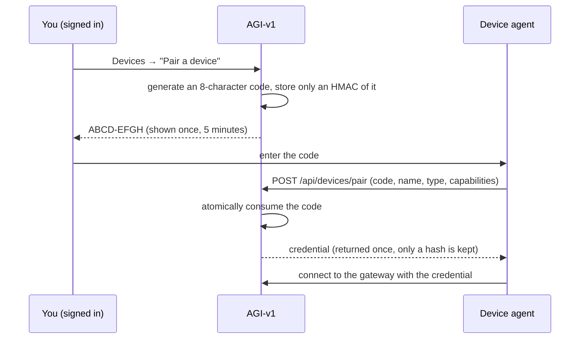

# Pairing a device

Pairing links a device to one AGI-v1 account and gives it a credential of its
own. It is the only way a device joins, and the only moment a credential is ever
shown.

---

## The flow



1. **Start pairing.** Sign in, open **Devices → Pair a device**. AGI-v1 shows a
   code like `K7QP-3MTX` and counts down.
2. **Enter it on the device.** The agent sends its name, platform, version and
   the capabilities it supports.
3. **Done.** The device is added, receives its own credential, and the code is
   dead. From then on the device authenticates with the credential.

---

## Properties of a pairing code

| Property | Value |
|---|---|
| Length | 8 characters |
| Alphabet | `23456789ABCDEFGHJKMNPQRSTVWXYZ` — no `0`, `1`, `I`, `L`, `O`, `U` |
| Lifetime | `DEVICE_PAIRING_TTL_SECONDS`, default 300 |
| Uses | Exactly one, claimed atomically |
| Rate limit | 5 codes per user per 10 minutes; 10 redemption attempts per source per 10 minutes |
| At rest | HMAC-SHA256 keyed with the server secret — never the plaintext |
| In logs | Never, not even a prefix |

Because a code is short enough to read aloud, it is low-entropy by design. The
protection is the combination of a 5-minute lifetime, single use, rate limiting,
and a keyed hash that cannot be ground down offline from a database copy.

Every failure — wrong code, expired code, already-used code — returns the **same
generic error**, so a caller cannot learn which.

---

## Credentials

A device credential looks like `agid_cred_<id>.<secret>`:

- The secret half is 32 random bytes.
- Only `sha256(secret)` is stored. Verification is constant-time.
- Lookup is by credential id, so verification stays O(1) without the plaintext.
- It is shown **once**, in the pairing response or the rotation response.

### Rotating

**Devices → Rotate credential** issues a new one and revokes every previous
credential for that device immediately. Use it if a device may have been
compromised but you want to keep its history and groups.

### Revoking

**Devices → Revoke** stops the device connecting or running anything, for good.
The device stays in your history for audit. `DELETE /api/devices/:id?purge=true`
removes it and its command history entirely.

A revoked device cannot reconnect: the credential fails authentication, the
gateway refuses the socket with a fatal error, and the agent stops retrying.

---

## Pairing each agent

### Simulated device

```bash
npm run simulate-device -- --name "Phone One" --type android_phone --code ABCD-EFGH
```

Afterwards the credential is stored, so later runs need no code:

```bash
npm run simulate-device -- --name "Phone One"
```

### Windows

```bash
npm run agent:windows -- --code ABCD-EFGH
```

See [windows-agent.md](./windows-agent.md).

### Android

Open the app, set the AGI-v1 and gateway URLs, enter the code, tap **Pair this
device**. See [android-agent.md](./android-agent.md).

### This browser

**Devices → Use this browser as a device.** No code and no credential: the
session cookie already proves who you are. The browser gets a deliberately narrow
capability set (`device.ping`, `device.status`, `url.open`,
`notification.show`).

---

## Where credentials live

| Agent | Location |
|---|---|
| Node agents (simulated, Windows) | `~/.agi-command/<name>.json`, mode `0600` |
| Android | `EncryptedSharedPreferences`, keyed from the Android Keystore |
| Browser | None — there is no credential to store |

Override the Node location with `AGI_AGENT_HOME`.

---

## Troubleshooting

**"That pairing code is not valid."** It expired, was already used, or was
mistyped. Generate a new one. The message is intentionally the same for all
three.

**"Too many pairing codes requested."** Five in ten minutes is the limit. Wait,
or use the code you already have.

**The device paired but shows offline.** Pairing and connecting are separate
steps. Check the gateway is running and the agent's gateway URL is right — see
[troubleshooting.md](./troubleshooting.md).

**A name came back different.** Device names are unique within an account, so a
second "Phone" becomes "Phone 2". Rename it in the Devices panel.
