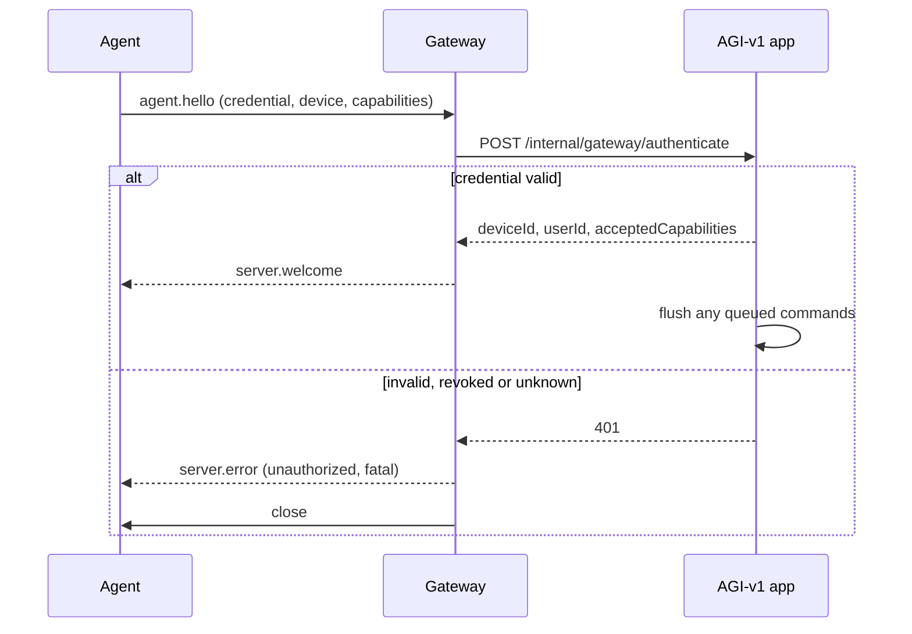

# Device protocol

Version: `agi-command/1`

This document is **normative for non-TypeScript agents**. The TypeScript
definition in [`src/devices/protocol.ts`](../src/devices/protocol.ts) and the
Kotlin mirror in `agents/android/.../Protocol.kt` must both match it. If the
Kotlin and this document disagree, this document wins and the Kotlin is the bug.

---

## Transport

- Secure WebSocket. Use `wss://` anywhere but local development.
- Endpoint: `<gateway>/agent`
- Frames are UTF-8 JSON text. Binary frames are rejected.
- Maximum frame size: **65536 bytes**. Larger frames are dropped unparsed.
- Rate limit: **120 frames per 10 seconds** per connection. Exceeding it closes
  the socket.

Every frame carries:

| Field | Type | Meaning |
|---|---|---|
| `v` | string | Protocol version, e.g. `"agi-command/1"` |
| `type` | string | Message type |
| `ts` | number | Sender's epoch milliseconds |

Only the **major** version must match. A mismatched major is refused with a fatal
`server.error` rather than being partially understood.

---

## Handshake



An agent that does not send `agent.hello` within **10 seconds** is disconnected.
Sending `agent.hello` twice on one connection is an error.

Only one live socket per device: a newer connection supersedes the older one,
which is closed with `server.error` code `superseded`.

---

## Agent → server

### `agent.hello`

```json
{
  "v": "agi-command/1",
  "type": "agent.hello",
  "ts": 1730000000000,
  "credential": "agid_cred_xxxxxxxx.<secret>",
  "device": {
    "name": "Phone One",
    "deviceType": "android_phone",
    "platform": "android",
    "platformVersion": "14",
    "agentVersion": "android-1.0.0"
  },
  "capabilities": [{ "name": "app.open", "version": 1 }]
}
```

`deviceType` is one of `android_phone`, `android_tablet`, `windows`, `browser`,
`generic`, `simulated`.

**This frame contains a live credential. It must never be logged.** Both the
gateway and the app redact it before writing anything.

### `agent.heartbeat`

Sent every `heartbeatIntervalMs` (from `server.welcome`). A device that has not
been heard from within `DEVICE_OFFLINE_AFTER_MS` is treated as offline.

```json
{ "v": "agi-command/1", "type": "agent.heartbeat", "ts": 1730000000000 }
```

### `agent.capabilities`

Re-advertise after the user enables or disables something locally.

```json
{
  "v": "agi-command/1", "type": "agent.capabilities", "ts": 1730000000000,
  "capabilities": [{ "name": "app.open", "version": 1 }]
}
```

### `command.acknowledged`

Sent **before** the work starts, so the server can tell "never arrived" from
"arrived and is slow".

```json
{
  "v": "agi-command/1", "type": "command.acknowledged", "ts": 1730000000000,
  "commandId": "cmd_...", "executionId": "exec_..."
}
```

### `command.progress`

Optional.

```json
{
  "v": "agi-command/1", "type": "command.progress", "ts": 1730000000000,
  "commandId": "cmd_...", "executionId": "exec_...",
  "percent": 40, "message": "opening"
}
```

### `command.completed`

```json
{
  "v": "agi-command/1", "type": "command.completed", "ts": 1730000000000,
  "commandId": "cmd_...", "executionId": "exec_...",
  "result": { "launched": true }
}
```

`result` is validated against the capability's output schema. A result that does
not match is reduced to `{}` rather than turning a real success into a failure.

### `command.failed`

```json
{
  "v": "agi-command/1", "type": "command.failed", "ts": 1730000000000,
  "commandId": "cmd_...", "executionId": "exec_...",
  "code": "unsupported", "message": "not implemented on this device"
}
```

| `code` | Execution state | Use when |
|---|---|---|
| `unsupported` | `unsupported` | The device cannot do this at all |
| `rejected` | `rejected` | The device refused (not allowlisted, nothing playing, permission denied) |
| `failed` | `failed` | It was attempted and did not work |
| `duplicate` | `rejected` | This command id was already processed |
| `invalid_parameters` | `failed` | Parameters did not make sense to the device |

### `agent.error`

Out-of-band problem report. Logged, not acted on.

---

## Server → agent

### `server.welcome`

```json
{
  "v": "agi-command/1", "type": "server.welcome", "ts": 1730000000000,
  "deviceId": "dev_...", "deviceName": "Phone One",
  "heartbeatIntervalMs": 15000,
  "acceptedCapabilities": ["app.open", "url.open"]
}
```

`acceptedCapabilities` is what the server will actually send — advertised
capabilities minus anything unknown, prohibited, or disabled by the user.

### `command.dispatch`

```json
{
  "v": "agi-command/1", "type": "command.dispatch", "ts": 1730000000000,
  "commandId": "cmd_...", "executionId": "exec_...",
  "capability": "app.open", "capabilityVersion": 1,
  "parameters": { "appId": "youtube" },
  "timeoutMs": 15000,
  "expiresAt": 1730000015000
}
```

### `command.cancel`

```json
{
  "v": "agi-command/1", "type": "command.cancel", "ts": 1730000000000,
  "commandId": "cmd_...", "executionId": "exec_..."
}
```

### `server.error`

```json
{
  "v": "agi-command/1", "type": "server.error", "ts": 1730000000000,
  "code": "unauthorized", "message": "device credential was rejected",
  "fatal": true
}
```

`fatal: true` means **stop reconnecting**. Retrying forever against a server that
has revoked you is a battery drain and a self-inflicted denial of service.

Codes: `unauthorized`, `bad_protocol`, `hello_timeout`, `not_identified`,
`already_identified`, `rate_limited`, `superseded`, `binary_unsupported`,
`malformed`, `too_large`, `unknown_type`.

---

## Agent obligations

An agent MUST:

1. Send `agent.hello` first, and nothing else before `server.welcome`.
2. Send heartbeats at the interval it was given.
3. Acknowledge a dispatch before executing it.
4. Report exactly one terminal result per dispatch.
5. **Refuse a replayed command** — keep the recently seen
   `commandId:executionId` pairs (200 is enough) and answer a repeat with
   `duplicate`.
6. **Refuse an expired dispatch** — if `expiresAt` has passed on arrival, answer
   `rejected` rather than running it late.
7. Refuse a capability it does not implement with `unsupported`.
8. Ignore malformed frames rather than crashing.
9. Reconnect with exponential backoff **and jitter**, unless the error was fatal.
10. Never log the credential.

An agent MUST NOT implement any capability on the prohibited list
(`shell.exec`, `camera.capture`, `lockscreen.bypass`, …). The server refuses to
register them, so advertising one only gets it dropped.

---

## Internal API (app ↔ gateway)

Not reachable from a browser. Authenticated with
`x-agi-gateway-secret`, compared in constant time. Both directions use the same
shared secret.

**App → gateway**

| Route | Purpose |
|---|---|
| `POST /internal/dispatch` | Send a `command.dispatch` to a connected device |
| `POST /internal/cancel` | Send a `command.cancel` |
| `GET /internal/health` | Liveness, connection count, uptime |
| `GET /internal/connections` | Device ids with a live socket |

**Gateway → app**

| Route | Purpose |
|---|---|
| `POST /internal/gateway/authenticate` | Verify a credential, return device identity |
| `POST /internal/gateway/heartbeat` | Device is alive |
| `POST /internal/gateway/disconnected` | Socket closed |
| `POST /internal/gateway/capabilities` | Re-advertisement |
| `POST /internal/gateway/result` | Acknowledgement, progress, completion or failure |

The app re-checks that the execution belongs to that command **and** that device
before applying any result. A result for someone else's execution is dropped, and
a result arriving after the execution finished is ignored rather than reopening
it.

---

## The browser as a device

A browser tab cannot connect to the gateway, because that would mean handing a
device credential to page JavaScript. Instead it receives `browser.dispatch`
events over the user's already-authenticated SSE stream
(`GET /api/agi-command/stream`) and posts results to
`POST /api/agi-command/browser-result` using the session cookie. Same execution
records, same policy, no credential in the page.
