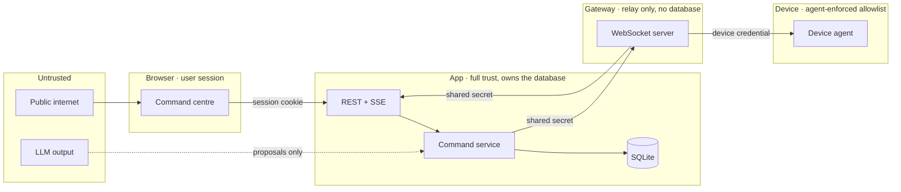

# Security and threat model

AGI Command lets a language model influence what happens on real hardware. This
document states what it defends against, what it does not, and where the trust
boundaries are.

---

## Trust boundaries

| Boundary | Crossed with | Enforced by |
|---|---|---|
| Browser → app | Session cookie (JWT) | `requireAuth`, per-user ownership checks |
| App ↔ gateway | `DEVICE_GATEWAY_INTERNAL_SECRET` | Constant-time comparison, both directions |
| Gateway ↔ agent | Per-device credential | `authenticateDevice`, revocation |
| Model → command | Nothing — output is data | Schema validation, capability registry, resolver |

**The LLM is inside the untrusted zone.** Its output is a proposal that must
survive schema validation, capability lookup, deterministic target resolution and
policy before anything happens. A malformed or invented plan is discarded.

---

## Threats and mitigations

### Someone guesses a pairing code

8 characters from a 30-symbol alphabet, valid for 5 minutes, single use, 10
attempts per source per 10 minutes. Codes are stored as an HMAC keyed with the
server secret, so a database copy cannot be brute-forced offline. Every failure
returns the same generic error.

### A stolen database

Contains no plaintext credentials and no plaintext pairing codes. Device secrets
are SHA-256 hashes of 32 random bytes; pairing codes are keyed HMACs. Neither is
reversible.

### A stolen device credential

It authenticates as that one device only, and grants exactly the capabilities
that device advertises and the user has left enabled. Revoke or rotate it —
either takes effect on the next connection attempt, immediately.

### A user reaching another user's devices

Every table carries `user_id` and cascades from `users`. Every repository read on
a request path is ownership-checked (`getOwned`). The resolver only ever reads
`listByUser(userId)`. Covered by tests in `tests/devicePairing.test.ts`,
`tests/deviceResolver.test.ts` and `tests/deviceRoutes.test.ts`.

### A replayed command

Three independent layers: the gateway suppresses a repeated
`commandId:executionId`; the agent keeps its own recently-seen set and answers
`duplicate`; and the server's `transitionIfOpen` refuses to move an execution
that already reached a terminal state. Commands also carry an expiry, and an
expired dispatch is refused by the agent rather than run late.

### A double-submitted request

Commands carry an idempotency key, unique per user. The chat path uses the
message id, so one chat message creates at most one command however many times
the client retries.

### A confirmation being reused for a different action

A confirmation is bound to one command (or one workflow run) **and** to a
fingerprint over the action, parameters and resolved targets. If the command
changes, the fingerprint no longer matches and the confirmation is rejected.
Confirmations are single-use and expire in two minutes.

### A prompt-injected or hallucinated action

The model cannot name a capability that does not exist, cannot supply a device
id, and cannot bypass policy. Prohibited capability names are refused at
capability lookup, at agent advertisement, and at command creation. Requests for
unsupported categories are answered with a plain refusal rather than an attempt.

### A malicious or buggy agent

Frames are size-capped (64 KB), rate-limited (120 per 10 s), and schema-validated.
A malformed frame is answered with an error, not a crash. An agent can only
report results for executions that belong to it — the app re-checks the command
and device on every result.

### A compromised gateway

The gateway holds no database and no user credentials. It can relay dispatches to
devices that are already connected and post results for them. It cannot create
commands, bypass policy, read memories, or reach another user's data. Run it on a
private network where possible.

---

## What is never allowed

Not configurable, not behind a flag:

- Unlocking a device, or bypassing a PIN, password, pattern or biometric.
- Hidden recording of microphone, camera or screen.
- Arbitrary shell, script or downloaded-code execution.
- Credential or keychain extraction.
- Privilege escalation, or disabling security software.
- Reading, writing or deleting files.
- Sending messages, placing calls, or making purchases.
- Location tracking.
- Reaching another user's devices.

Enforced by `PROHIBITED_CAPABILITIES` in
[`capabilities.ts`](../src/devices/capabilities.ts) and the refusal path in
[`policy.ts`](../src/devices/policy.ts).

---

## Risk levels and confirmation

| Level | Examples | Default |
|---|---|---|
| `read_only` | list devices, battery, volume, status | run |
| `low` | open an allowlisted app, open a URL, media, volume, notification, wake screen | run |
| `moderate` | fan-out to 4+ devices, queue for later, run a workflow | ask first |
| `high` | messaging, camera/mic, deletion, security settings, purchases | not implemented |
| `prohibited` | everything in the list above | refuse |

Risk is escalated by context, never lowered. A low-risk action across many
devices becomes moderate and asks.

---

## Logging

Never written to logs, at any level:

- Device credentials and pairing codes (`agent.hello` is redacted before logging)
- JWTs, API keys, the gateway internal secret
- Audio, transcripts of audio, or raw voice data
- Command parameters beyond what is needed to diagnose

The audit trail (`device_events`) records a coarse event kind and a short
human-readable detail. Retention is bounded by `DEVICE_EVENT_RETENTION_DAYS`
(default 30) and pruned hourly.

---

## Production checklist

- [ ] `AGI_COMMAND_ENABLED=true` only where you want device control
- [ ] `DEVICE_GATEWAY_INTERNAL_SECRET` ≥ 32 random characters, different per environment
- [ ] Gateway reachable over `wss://` with a valid certificate
- [ ] Gateway on a private network or firewalled to the app
- [ ] `JWT_SECRET` set explicitly, not auto-generated
- [ ] Distinct secrets in staging and production
- [ ] Devices reviewed periodically; unknown ones revoked

The app refuses to start with `AGI_COMMAND_ENABLED=true` and a missing or short
internal secret — see `assertDeviceConfig` in [`config.ts`](../src/config.ts).

---

## Reporting

Found a hole? Open an issue at
<https://github.com/aryamthecodebreaker/AGI-v1/issues> without a working exploit
in the title.
