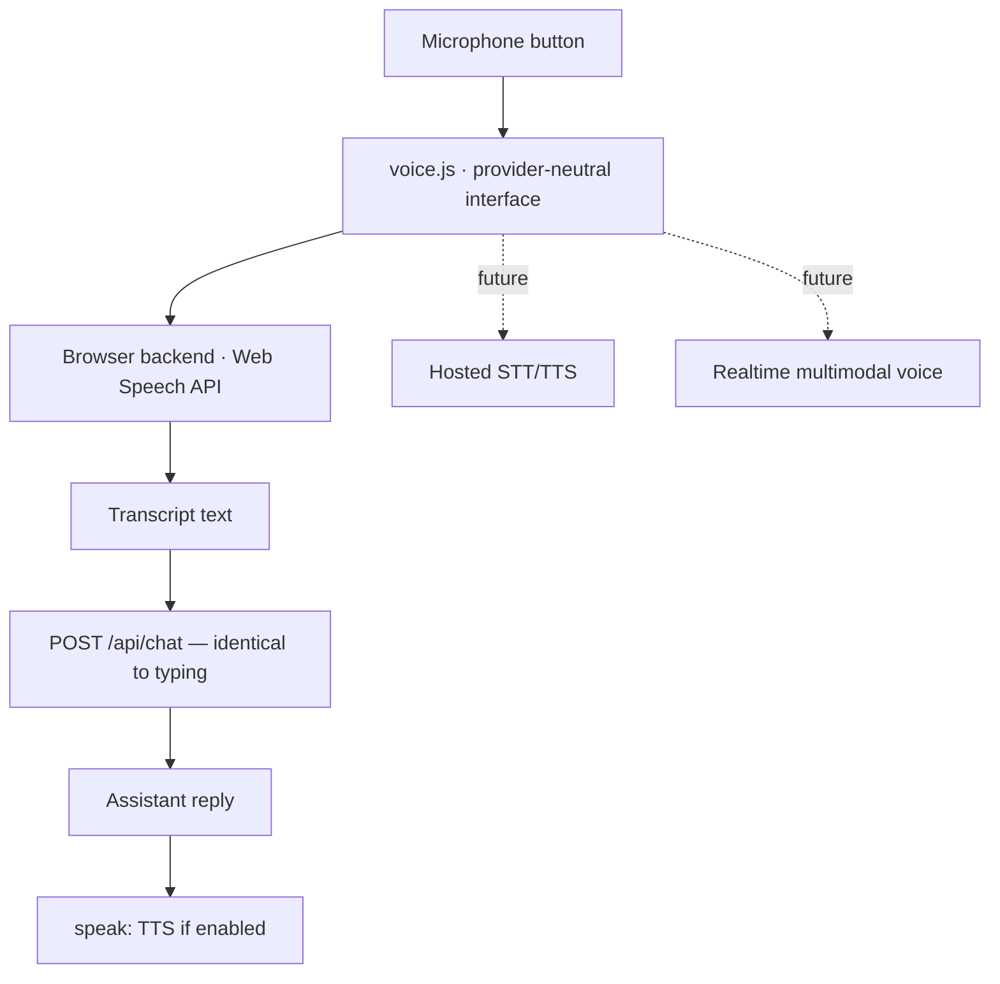

# Voice architecture

Voice is an input method, not a separate product. Everything it produces goes
through exactly the same chat turn as typed text, so anything you can say you can
also type — and vice versa.

---

## Design constraints

- **Voice is a chat feature, not a device feature.** The microphone appears
  whenever the browser supports speech, regardless of whether AGI Command is
  enabled. (It was briefly gated behind device control, which meant it never
  appeared on deployments with the feature switched off.)
- **Nothing listens until you press a button.** There is no wake word and no
  hidden always-listening mode. Two explicit ways in:
  - **Push to talk** — hold the microphone, or click once to start and again to
    stop. One utterance per press.
  - **Call mode** — press *Call* for a hands-free conversation: listen → send →
    speak → listen. It is visibly active the entire time (the button pulses),
    and pressing *Call* again, or *Stop*, ends it. It also ends itself if the
    microphone is refused or a turn fails, so it can never quietly loop.
- **AGI-v1 never receives or stores audio.** Only recognised text reaches
  `/api/chat`, exactly as if it had been typed. No audio is written to disk or
  sent to the server at any point.
- **Text is never a second-class path.** If the microphone is unavailable or
  permission is refused, the UI says so plainly and typing keeps working.

## Where your audio actually goes

**No API key is required. That does not mean recognition is local.** The Web
Speech API is free because the browser vendor absorbs the cost, not because the
work happens on your machine:

| Browser | What happens to the audio |
|---|---|
| Chrome / Edge | Streamed to **Google's** speech servers; text comes back. It leaves the machine. |
| Safari | Sent to **Apple**, unless on-device dictation is installed for the language, in which case it may stay local. |
| Firefox | `SpeechRecognition` is not implemented. Voice is unavailable and the microphone button is disabled. |

So the honest statement is: *AGI-v1* never sees your audio, but in the most
common browser your audio does leave the device — to the browser vendor, not to
this application.

If that is unacceptable for your use, set `VOICE_BACKEND=none` and type. A
genuinely local option would need an on-device STT model (for example Whisper
compiled to WASM) behind the same interface; the seam exists, the implementation
does not.

Text-to-speech (`speechSynthesis`) is normally local on all three browsers,
using installed system voices.

---

## Layers



[`public/voice.js`](../public/voice.js) defines the interface:

```js
{
  sttAvailable, ttsAvailable,
  startListening(), stopListening(),
  speak(text), stopSpeaking(),
  setSpeakingEnabled(bool)
}
```

Adding a hosted provider means writing another object with this shape and
selecting it — nothing in the command centre changes.

A backend that is configured but not implemented reports itself unavailable and
says so, rather than silently doing nothing.

---

## Configuration

```dotenv
VOICE_BACKEND=browser      # browser | none
VOICE_STT_BACKEND=         # reserved for a hosted speech-to-text provider
VOICE_TTS_BACKEND=         # reserved for a hosted text-to-speech provider
```

The server reports the selected backend at `GET /api/agi-command/status`, and the
client builds the matching voice layer.

`VOICE_BACKEND=none` disables voice entirely; the microphone button is disabled
with an explanation.

---

## Browser backend

Uses `SpeechRecognition` (`webkitSpeechRecognition` on Chromium) and
`speechSynthesis`. Both are built into the browser and need no API key — but see
[Where your audio actually goes](#where-your-audio-actually-goes): recognition is
generally a vendor round trip, not an on-device one.

- `continuous = false` — one utterance per press. This is what makes
  push-to-talk real rather than cosmetic.
- `interimResults = true` — the partial transcript is shown while you speak, so
  you can see what it is hearing.
- A fresh recognition instance per press, because reusing one across errors is
  unreliable across browsers.

Support is uneven. Safari and Firefox have historically had partial or absent
`SpeechRecognition`. The UI detects this at runtime and disables the microphone
with a message rather than failing on click.

### Error handling

| Condition | What the user sees |
|---|---|
| Permission refused | "Microphone permission was refused. You can still type." |
| No microphone | "No microphone was found. You can still type." |
| Nothing heard | "I did not hear anything." |
| Not supported | Microphone button disabled, with a tooltip |

---

## States

The orb and the status line show the same state, and the status line is always
written in words — nothing is conveyed by motion or colour alone.

```
idle · listening · transcribing · thinking · confirming
dispatching · executing · speaking · success · partial · error
```

`confirming`, `executing`, `success`, `partial` and `error` are driven by real
command state, not by optimism: the orb only turns green once devices have
actually reported.

---

## Accessibility

- The microphone works with pointer hold **and** with click-to-toggle, so
  keyboard and screen-reader users are not required to hold a key.
- `Space` and `Enter` toggle listening when the button has focus.
- Every icon button carries a visually hidden text label.
- The transcript, status and command strip are `aria-live` regions.
- The orb is `aria-hidden` — it is decoration, and its meaning is duplicated in
  text.
- Under `prefers-reduced-motion` the orb draws one static frame per state change
  instead of animating, and CSS transitions across the app are reduced to near
  zero.

---

## Spoken responses

Replies are spoken when TTS is available and speaking is enabled. The **stop**
button cancels speech immediately and returns the orb to idle.

Confirmations are deliberately *not* auto-confirmed by voice: a spoken "yes"
still goes through the same single-use, fingerprint-bound confirmation as a
click.

---

## What is not implemented

- No wake word, and none planned. Call mode is hands-free but explicitly
  started and visibly active; a wake word would be neither.
- No speaker identification or voice biometrics.
- No server-side audio storage. AGI-v1 never receives audio, so there is nothing
  to store — but this is not the same as the audio never leaving your device.
- No on-device speech recognition. The browser backend delegates to the browser
  vendor; see the table above.
- Hosted STT/TTS providers are stubs that report unavailable — the seam exists,
  the implementations do not.
